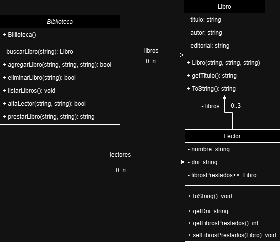

# Sistema de Biblioteca

## Materia: Desarrollo de Software Orientados a Objetos
## Comisión: D
## Grupo: 1

### Integrantes del Equipo

Este proyecto fue desarrollado por el siguiente equipo de trabajo:

- **Eduardo Moreno**  
  Email: e.m.morenolp@gmail.com  
  Nombre Completo: Eduardo M Moreno
  
- **Leandro Paryszewski**  
  Email: cacholeo@gmail.com  
  Nombre Completo: Leo Pary
  
- **Marcelo Moreno**  
  Email: javiacode@gmail.com  
  Nombre Completo: Marcelo Javier Moreno
  
- **Lautaro Colella**  
  Email: lautarocolella1@gmail.com  
  Nombre Completo: Molo Gavarb
  
- **Melissa Galeano Ibañez**  
  Email: melissa.g.galeano@gmail.com  
  Nombre Completo: Melissa Galeano Ibañez

---

## Descripción

Este proyecto simula una biblioteca en la que los usuarios pueden registrar lectores, agregar libros a la biblioteca, y realizar préstamos de libros, con algunas restricciones en los préstamos. Cada lector puede tener hasta un máximo de 3 libros en préstamo al mismo tiempo.

## Objetivo del Trabajo Práctico

El objetivo de este trabajo práctico es desarrollar un sistema de gestión de biblioteca utilizando los principios de la programación orientada a objetos, a fin de practicar la creación y manipulación de clases, objetos, y la implementación de relaciones entre ellos. Este sistema debe permitir la gestión de libros, lectores y préstamos de libros dentro de una biblioteca.

## Funcionalidades

- **Alta de Lector**: Permite registrar un nuevo lector en la biblioteca, con su nombre y DNI. Si el lector ya está registrado, no se puede volver a registrar.
- **Agregar Libro**: Permite agregar un libro a la biblioteca con un título, autor y editorial. Si el libro ya está registrado, no se puede agregar nuevamente.
- **Prestar Libro**: Permite realizar el préstamo de un libro a un lector, siempre y cuando el lector esté registrado, el libro exista en la biblioteca y el lector no haya alcanzado el límite de préstamos (3 libros).
- **Listado de Libros**: Muestra todos los libros disponibles en la biblioteca.
- **Eliminar Libro**: Permite eliminar un libro de la biblioteca.

## Diseño del Sistema

El sistema se compone de las siguientes clases principales:

- **Libro**: Representa un libro dentro de la biblioteca, con atributos como título, autor y editorial.
- **Lector**: Representa un lector registrado en la biblioteca, con atributos como nombre, DNI y la lista de libros prestados.
- **Biblioteca**: Gestiona los libros disponibles y los lectores registrados. Contiene métodos para agregar libros, registrar lectores, y realizar préstamos.

## Diagrama de Clases

## Casos de Prueba y Ejemplos

A continuación se muestran algunos ejemplos de uso del sistema:

1. **Alta de un Lector**:
   - Entrada: Nombre: "Pepe", DNI: "12345678"
   - Salida esperada: "Lector registrado exitosamente."

2. **Préstamo de un Libro Existente**:
   - Entrada: Título del libro: "Libro3", DNI del lector: "12345678"
   - Salida esperada: "Préstamo exitoso."

3. **Préstamo con Lector Inexistente**:
   - Entrada: Título del libro: "Libro3", DNI del lector: "12345679"
   - Salida esperada: "Lector inexistente."

4. **Préstamo con Libro Inexistente**:
   - Entrada: Título del libro: "Libro4", DNI del lector: "12345678"
   - Salida esperada: "Libro inexistente."

5. **Préstamo con Tope de Préstamos Alcanzado**:
   - Entrada: Título del libro: "Libro5", DNI del lector: "12345678" (y el lector ya tiene 3 libros prestados)
   - Salida esperada: "Tope de préstamo alcanzado."

## Requisitos

- **.NET 5 o superior**
- **Visual Studio 2019 o superior** (o cualquier IDE compatible con C#)

## Tecnologías utilizadas

- **C#**: Lenguaje de programación utilizado para implementar la lógica del sistema.
- **.NET**: Framework utilizado para ejecutar la aplicación.

## Conclusiones

A través del desarrollo de este sistema, hemos logrado aplicar los conceptos fundamentales de la programación orientada a objetos, como clases, objetos, encapsulamiento y relaciones entre objetos. La implementación de este sistema nos ha permitido comprender mejor cómo organizar y gestionar la información de una manera estructurada y escalable.